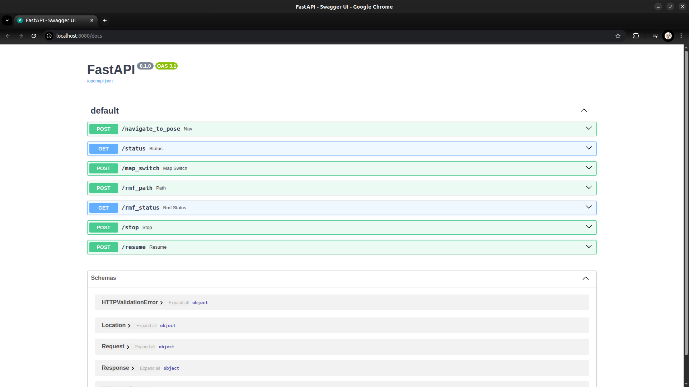

# **What Is This?**

This is a `HTTP` server running a simulated robot, that is useful for testing [Open-RMF](https://www.open-rmf.org/) among other things.

# **Dependencies**
- python
- pip

# **Build**

```bash
git clone https://github.com/jh-chng/invisibot.git --depth 1 --single-branch --branch main && cd invisibot
```

```bash
virtualenv -p python3 venv
```

```bash
source venv/bin/activate
```

```bash
pip install -r requirements.txt
```

# **Run**

```
python3 -m invisibot
```

### **Verify**

Access endpoints on http://localhost:8080/docs.

You should see something similar to what is shown below:


### **Maintainer(s)**

- [jn-chng](https://github.com/jh-chng)